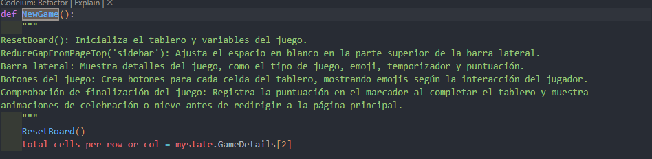

# Requistos vs código
## Requisitos Funcionales y Criterios de Aceptación

| Requisito y Criterios de Aceptación                                   | Código/Imagen                         |
|-----------------------------------------------------------------------|---------------------------------------|
| **1. Configuración de Nivel de Dificultad** **Requisito:** El sistema debe permitir a los jugadores seleccionar el nivel de dificultad antes de comenzar el juego. **Criterios de Aceptación:** - Opciones de dificultad fácil, medio y difícil disponibles para selección. - La configuración de dificultad debe influir en la mecánica del juego, como la frecuencia de regeneración de imágenes y la puntuación. - Tiempos de regeneración específicos:   - Fácil: cada 8 segundos.   - Medio: cada 6 segundos.   - Difícil: cada 5 segundos. |                    |
| **2. Inicialización del Tablero** **Requisito:** Al comenzar un juego, el sistema debe inicializar el tablero con un conjunto aleatorio de imágenes basado en la dificultad seleccionada. **Criterios de Aceptación:** - El tablero debe ser llenado con imágenes de emojis que corresponden a la dificultad elegida. - Ninguna imagen objetivo (emoji de la barra lateral) debe aparecer más de una vez en el tablero inicial. - La imagen objetivo debe ser seleccionada aleatoriamente y mostrada en la barra lateral. |                |
| **3. Parametrización del Nombre del Jugador y País** **Requisito:** El sistema debe permitir a los jugadores ingresar su nombre y país antes de comenzar el juego. **Criterios de Aceptación:** - Debe existir un campo de texto para que los jugadores ingresen su nombre y país. - Es posible que los campos de nombre y país estén vacíos, pero en ese caso no se muestra el _Leaderboard_ - La información del jugador debe persistir durante la sesión de juego. |                    |
|**4. Gestión de Puntaje y Validación de RespuestasRequisito:** **Requisito:** El sistema debe gestionar y actualizar el puntaje del jugador en tiempo real, validando las respuestas durante el juego. **Criterios de Aceptación:** - El puntaje del jugador se actualiza automáticamente según las respuestas seleccionadas. - Se valida si la selección de una casilla es correcta o incorrecta comparándola con la imagen objetivo en la barra lateral. - Se aplican bonificaciones por respuestas correctas y penalizaciones por respuestas incorrectas en la puntuación del jugador. |                    |
|**5. Inicio y Reinicio de JuegoRequisito:** **Requisito:** El jugador debe poder iniciar un nuevo juego en cualquier momento, lo que implica restablecer el tablero y las condiciones del juego según el nivel de dificultad elegido.  **Criterios de Aceptación:**  -Existe un botón o función clara para iniciar un nuevo juego. - Al iniciar un nuevo juego, se restablece el tablero y se aplican las condiciones del nivel de dificultad seleccionado. |               M     |
|**6.Finalización del JuegoRequisito:** **Requisito:** El juego debe finalizar cuando el jugador ha seleccionado todas las celdas en el tablero, mostrando un mensaje de felicitaciones o derrota según la puntuación obtenida.  **Criterios de Aceptación:**  - Al completar todas las selecciones en el tablero, se muestra un mensaje de felicitaciones si la puntuación es positiva.  - Si la puntuación es negativa, se muestra un mensaje de derrota. - Se proporciona un botón para regresar a la página principal después de finalizar el juego. |                    |
